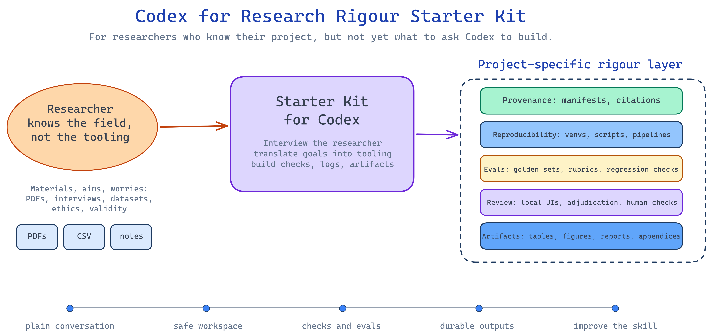
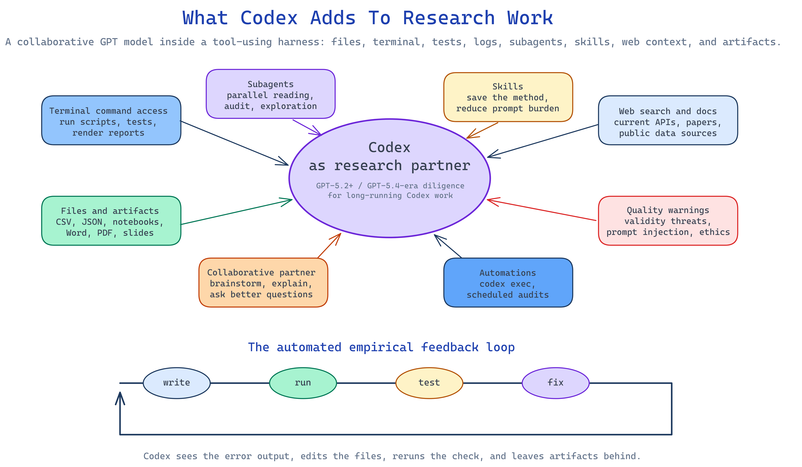
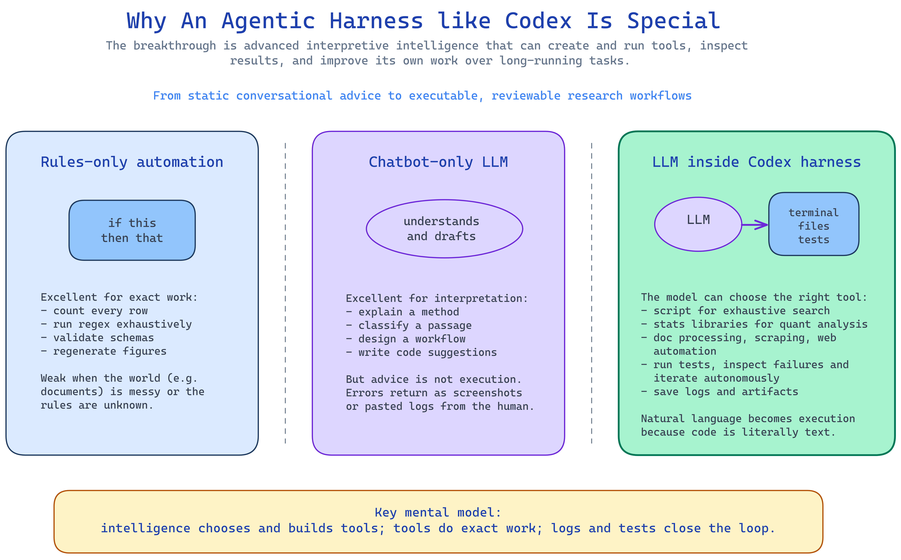

# Research Rigour Skills Starter Pack

This starter pack helps academic researchers use Codex to build rigorous, reproducible, project-specific research workflows.

It is not an opinionated off-the-shelf research platform that forces you to work a certain way. It is a promptable starting point for creating the scaffolding your project needs: source manifests, audit trails, reproducible scripts, evaluation loops, local review tools, data checks, citation checks, report generation, and custom Codex skills.

The core idea is simple: many researchers know they need rigour, quality, reproducibility, validity, and auditability, but without a coding background let alone agentic AI experience, they often do not yet know what to ask an agentic tool like Codex to build. This skill gives Codex the missing context so it can interview the researcher, suggest useful options, and turn high-level research goals into durable project infrastructure.

<p align="center">
  
</p>

## Who This Is For

This is designed for researchers who may be experts in their domain but new to coding, terminals, Git, Python environments, APIs, or automation.

You do not need to know what a script, virtual environment, JSON schema, test, log, or local web UI is before you start. The point of the starter kit is to help Codex explain those ideas in plain language and set them up only when they help the research.

It is especially useful for:

- qualitative research and document analysis
- literature reviews and evidence synthesis
- quantitative data analysis
- surveys and experiments
- computational social science and NLP workflows
- public web data collection
- research projects that need audit trails, evals, or reproducible outputs

## What The Skill Does

The main skill is in the SKILL.md file.

It tells Codex to act as a technical research engineer and rigour assistant. In practice, that means Codex should:

- ask the researcher about their project, materials, outputs, constraints, and quality concerns
- explain technical options in plain language
- suggest a sensible project structure
- recommend Git checkpoints and backups without assuming the user already knows Git
- create or explain a Python virtual environment when needed
- protect raw data and sources from accidental overwriting
- build provenance, logs, data dictionaries, manifests, schemas, and evidence tables
- create evals and review workflows where outputs need quality checks
- use deterministic code for exact tasks and LLMs for semantic tasks
- create scripts, notebooks, local review UIs, reports, figures, spreadsheets, or Word/PDF artifacts
- turn repeated workflows into custom skills
- suggest subagents, worktrees, automations, and `codex exec` when they fit the job

## How To Use This Starter Pack

The only file you really need is [`SKILL.md`](SKILL.md). The basic idea is:

1. Create a new folder for your research project.
2. Copy `SKILL.md` into that folder.
3. Open that folder as your Codex workspace.
4. Ask Codex to help you set up the project.

Codex works on a folder, not on an abstract idea. That folder is the workspace where it can read files, create scripts, organise sources, write notes, run checks, and save outputs. For a new research project, make a fresh folder first, even if it only contains `SKILL.md` at the beginning.

### Option 1: Codex App, Recommended

Use the desktop app if you are new to Codex. It gives you a clear project picker, local threads, review tools, and a simpler interface than the terminal.

1. Install the Codex app from the official OpenAI docs:
   - [Mac app downloads, Apple Silicon and Intel](https://developers.openai.com/codex/app#getting-started)
   - [Windows app download](https://developers.openai.com/codex/app#getting-started)
2. Create a new folder for your project. For example:
   - `my-interview-study`
   - `systematic-review-project`
   - `survey-analysis`
3. Copy this starter pack's `SKILL.md` file into that new folder.
4. Open the Codex app, sign in, and choose the new folder as your project.
5. Make sure Codex is working locally in that project folder.
6. Send a first message like:

```text
Please read SKILL.md and use it as your instructions for helping me set up this research project. Start by asking me the key questions you need to understand my project, then suggest a simple first project structure.
```

After that, you can add your PDFs, notes, spreadsheets, interview files, data exports, or draft writing to the same folder and ask Codex to help organise, check, analyse, or transform them.

### Option 2: Visual Studio Code With The Codex Extension

Use this route if you already use Visual Studio Code or want to see and edit the project files yourself while Codex works.

1. Install [Visual Studio Code](https://code.visualstudio.com/) if you do not already have it.
2. Install the official [Codex extension from the Visual Studio Code Marketplace](https://marketplace.visualstudio.com/items?itemName=openai.chatgpt). OpenAI's [Codex IDE extension docs](https://developers.openai.com/codex/ide) have more setup details.
3. Create a new project folder on your computer.
4. Copy `SKILL.md` into that folder.
5. Open the folder in VS Code with **File > Open Folder**.
6. Open the Codex panel in VS Code and sign in.
7. Ask Codex:

```text
Please read SKILL.md in this workspace and follow it as the research assistant skill for this project. First, interview me about the project and then help me create the initial project structure.
```

The important detail is that VS Code must have the project folder open. If you only open an individual file, Codex will not have the full workspace it needs.

### Option 3: Pure CLI

Use the CLI if you are comfortable opening a terminal, or if someone technical is helping you set things up.

1. Install the Codex CLI using the official [Codex CLI docs](https://developers.openai.com/codex/cli). The OpenAI quickstart currently lists:

```bash
npm install -g @openai/codex
```

or, on macOS with Homebrew:

```bash
brew install codex
```

2. Create a new project folder:

```bash
mkdir my-research-project
cd my-research-project
```

3. Copy `SKILL.md` into that folder.
4. Start Codex from inside the folder:

```bash
codex
```

5. Sign in when prompted, then ask:

```text
Please read SKILL.md and use it as your instructions for this research project. Start by asking me what the project is about, what materials I have, what outputs I need, and what quality or rigour concerns matter most.
```

Starting Codex from inside the project folder matters because the CLI treats the current folder as the workspace.

### What To Do Next

Once Codex has read the skill, you do not need to know the technical vocabulary in advance. Describe your project in normal research language. For example:

```text
I am doing a literature review on local climate adaptation policies. I have about 80 PDFs and need a transparent way to extract study details, track inclusion decisions, and produce an evidence table.
```

or:

```text
I have interview transcripts and want help creating a rigorous coding workflow with audit trails, codebook versions, and a way to compare coded excerpts.
```

Codex should then help you decide what to create first: folders, a source manifest, a data dictionary, scripts, review spreadsheets, a local review interface, analysis notebooks, or project-specific instructions.

## Codex's main superpower

Codex is powerful because it combines two things that are usually separate:

1. An advanced language model that can understand messy research goals, documents, code, methods, and natural language.
2. An agentic terminal-based coding harness that can read files, edit files, run commands, test outputs, keep logs, and iterate over long-running tasks.

That second part matters. A normal chatbot can suggest code. Codex can write the code, run it, inspect the failure, fix it, rerun it, save the result, and explain what changed. That gives the model an empirical feedback loop.

For research, this means the assistant can help create working infrastructure rather than just advice: data checks, reproducible pipelines, local review interfaces, citation verification, audit logs, and generated reports.

<p align="center">
  
</p>

## Why Not Just Use A Generic Tool?

Research projects vary too much for one rigid workflow to fit everyone.

An interview study, a corpus analysis, a public-web monitoring project, a systematic review, a survey experiment, and an econometric analysis all need different forms of rigour. This starter pack does not impose one model. It teaches Codex to help the researcher create the right workflow for their project.

The philosophy is:

- start small
- make raw materials safe
- create durable artifacts
- record decisions
- add checks and evals where they matter
- keep humans in the loop for high-stakes or ambiguous judgements
- improve the workflow as the project teaches you where it is fragile

## Deterministic Automation And LLM Intelligence

One of the most important ideas in this starter kit is that "AI" and "automation" are not the same thing.

Deterministic code is best for exact, repeatable operations:

- counting rows
- checking file hashes
- validating JSON
- running regex over a whole corpus
- profiling joins
- regenerating figures
- running statistical models

LLMs are best for semantic and interpretive operations:

- understanding messy documents
- classifying excerpts
- extracting claims
- matching ambiguous entities
- explaining methods
- drafting synthesis notes
- judging whether evidence supports a claim

The strongest workflows combine both. Ask the LLM to understand, classify, or design. Ask code to count, validate, search, rerun, and verify. Ask humans to review ambiguous or high-impact decisions.

The calculator analogy is useful: a person can probably calculate `14 x 14` in their head and be right 99% of the time, but a calculator is the right tool for exact arithmetic. Likewise, an LLM can often spot text patterns, but for exhaustive search across a huge document it should write and run a deterministic script because this is lots and lots of sub-tasks that need to be right and would exhaust the LLM's context window quickly risking misses and hallucinations. Wherever a task can be fully deterministic, a deterministic approach should be used.

<p align="center">
  
</p>

## Visual Overview

The diagrams in [`diagrams/`](diagrams/) are intended for workshops, slides, and project introductions. They are shown inline above and are also available as standalone PNGs.

| Diagram | Purpose |
| --- | --- |
| [`01_skill_value_overview.png`](diagrams/01_skill_value_overview.png) | High-level value: how the skill helps non-technical researchers turn research aims into rigorous Codex projects. |
| [`02_codex_research_superpowers.png`](diagrams/02_codex_research_superpowers.png) | The Codex capability map: subagents, skills, terminal access, web search, logs, evals, collaboration, and diligent GPT-5.2+ era models. |
| [`03_agentic_harness_model.png`](diagrams/03_agentic_harness_model.png) | The mental model: why an intelligent LLM inside a terminal harness is more powerful than chatbot-only code advice or rules-only automation. |

Each PNG is rendered from an editable `.excalidraw` file in the same folder.

## Current Feature Context

Codex and OpenAI model guidance change quickly. The skill includes a source-check section with official docs used when this draft was created. Before making strong claims about current models, pricing, automations, or security defaults, ask Codex to re-check the latest official OpenAI documentation.
